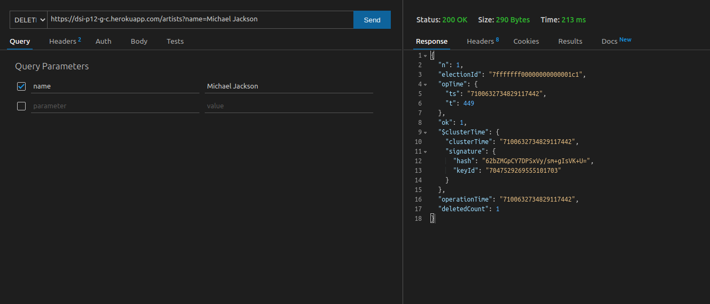

# PRACTICA 12 - REST API

>Informe para la asignatura de Desarrollo de Sistemas Informáticos
>
>>**Grupo C** - **Última modificación**: 28/03/2022
>>
>>>[Alejandro Martín de León](alu0101015941@ull.edu.es)
>>>
>>>[Eric Dürr Sierra](alu0101027005@ull.edu.es)
>>>
>>>[Eric Fumero Arteaga](alu0101105741@ull.edu.es)
>>>
>>>[Jeff Pérez Frade](alu0101038520@ull.edu.es)

***

## [Enlace a la documentación generada con TypeDoc](http://dsi-p12-code-docs.surge.sh/modules.html)

## Indice

- [PRACTICA 12 - REST API](#practica-12---rest-api)
  - [Enlace a la documentación generada con TypeDoc](#enlace-a-la-documentación-generada-con-typedoc)
  - [Indice](#indice)
  - [Introducción](#introducción)
  - [Objetivos](#objetivos)
  - [Actividades previas](#actividades-previas)
  - [Elaboración de la práctica](#elaboración-de-la-práctica)
    - [Diseño y estructuración del proyecto](#diseño-y-estructuración-del-proyecto)
    - [Creación de las interfaces de los objetos de la aplicación](#creación-de-las-interfaces-de-los-objetos-de-la-aplicación)
    - [*Schema* y modelos de Mongoose](#schema-y-modelos-de-mongoose)
    - [controladores para cada sección de la API](#controladores-para-cada-sección-de-la-api)
    - [Implementación de los routes para cada sección de la API](#implementación-de-los-routes-para-cada-sección-de-la-api)
    - [Configuración e instanciación de la App de Express](#configuración-e-instanciación-de-la-app-de-express)
    - [Configuración, Ejecución y lanzamiento de los servicios](#configuración-ejecución-y-lanzamiento-de-los-servicios)
    - [Publicación en Heroku](#publicación-en-heroku)
    - [Creación de la base de datos en MongoDB Atlas](#creación-de-la-base-de-datos-en-mongodb-atlas)
    - [Pruebas con Thunder Client](#pruebas-con-thunder-client)
  - [Dificultades](#dificultades)
  - [Conclusiones](#conclusiones)
  - [Referencias](#referencias)
  - [Comandos npm del repositorio](#comandos-npm-del-repositorio)

***
## Introducción

En este informe se recoge el proceso deu implementación seguido y la gestión del trabajo en grupo durante el desarrollo de la API REST de la práctica 12. En dicha API REST se espera recoger, mediante un modelo CRUD, peticiones para cada una de las secciones concretas de la aplicación de Playlist de la práctica 7, contemplando concretamente rutas para los artistas, las canciones y las propias listas de reproducción.
***

## Objetivos

La API REST debe estar implementada y testeada mediante una colección de consultas de ***Thunder Client*** exportada en un JSON. Esta API REST debe a demás estar desplegada en un servidor de ***Heroku*** para su acceso *online* y debe conectarse a una base de datos en el servicio clpud de MongoDB Atlas.

Los objetivos concretos a la hora de finalizar las prácticas son:

- Implentación de un router para todas las peticiones relacionadas con las canciones y que clasifiquen bajo la ruta `/songs`
- Implentación de un router para todas las peticiones relacionadas con los artistas y que clasifiquen bajo la ruta `/artists`
- Implentación de un router para todas las peticiones relacionadas con las playlists y que clasifiquen bajo la ruta `/playlists`
- Una interfaz para definir los objetos Song en la base de datos
- Una interfaz para definir los objetos Artist en la base de datos
- Una interfaz para definir los objetos Playlist en la base de datos
- Un modelo de Mongoose para las canciones
- Un modelo de Mongoose para los artistas
- Un modelo de Mongoose para las playlist
- Un fichero de implementación de la aplicación de Express donde se incluyen las rutas y los módulos a usar (`app.ts`)
- Un fichero de instanciación y ejecución del servidor donde se inician los servicios de MongoDB y Express (`server.ts`)
- Todos los ficheros documentados mediante comentarios de ***Typedoc***
- Documentación generada y desplegada como página web estática en Surge.sh
- La API desplegada en un servidor de Heroku y configurada para conectarse a la base de datos
- Una base de datos en el servicio en la nube MongoDB Atlas
- Un informe del proceso redactado y publicado en Github Pages

***
## Actividades previas

Dentro de las actividades previas, obviando las fases de creación del entorno del proyecto y aceptación de la tarea, se cumplen algunas reuniones iniciales para establecer los objetivos a cumplir y asignar las tareas de implementación.

La creación de una cuenta en los servicios de Heroku y MongoDB Atlas también se incluyen entre estas tareas junto con la creación de una base de datos concreta para esta práctica y una aplicación en heroku específica para alojar la API.

***

## Elaboración de la práctica

En la siguiente sección se describen los distintos pasos realizados para el desarrollo, pruebas y publicación de la API

### Diseño y estructuración del proyecto

El proyecto se construye de manera similar a los entornos de TypeScript que se han ido desarrollando para las prácticas de la asignatura, con lo cual tódo el código fuente se encuentra recogido bajo la carpeta `src/` y dentro de esta se han distinguido las secciones que componen el servicio en su totalidad.

Se dividen la configuración de la aplicación express y el lanzamiento del servidor en dos ficheros distintos para mejorar la modularización del proyecto. De esta manera en el fichero `app.ts` sólo se crea una instancia de Express, se incluyen los paquetes a utilizar y se recogen todas las rutas de la aplicación.

Por otro lado, el fichero `server.ts` permite configurar y lanzar una instancia de MongoDB a la par que se incluye la aplicación de Express exportada desde el fichero `app.ts` para lanzar su ejecución.

Todos los componentes relativos a la ejecución de las peticiones a la API se han separado en:

- `controllers`: donde se separa la lógica de negocio y de tratamiento de datos para procesar mediante promesas cada una de las peticiones en un objeto único para cada una de las rutas
- `models`: en este directorio se recopilan las interfaces y modelos para configurar y construir con Mongoose las colleciones de la base de datos
- `routes`: Todos los ficheros para representar las rutas de la aplicación se reunen bajo este directorio y permiten gestionar individualmente cada uno de los tipos de operaciones HTTP y la ruta y controlador al que se asignan.

Este diseño, en su conjunto, permite una mejor visión general de cómo se comunican los elementos que constituyen la API. Se opta por modularizar de esta manera el repositorio principalmente por la limpieza de código que aporta.

### Creación de las interfaces de los objetos de la aplicación

Hemos creado varias interfaces para poder definir cómo deberían estructurarse los *Schemas* de los diferentes objetos de nuestra BBDD (artists, songs y playlists), estas interfaces son bastantes sencillas ya que sólo contienen los diferentes tipos de datos con los que cuenta cada objeto, en este caso ponemos el ejemplo de las playlists:

```TS
export interface PlaylistInterface {
  name: string,
  songs: string[],
  seconds: number,
  genres: string[]
}
```

Como podemos ver lo único que hacemos es crear una interfaz para definir qué datos contiene dicho objeto y de qué tipos se tratan. Como hemos mencionado anteriormente estas interfaces se encuentran dentro de la carpeta `models`.

### *Schema* y modelos de Mongoose

Con las interfaces definidas comenzaremos a realizar los schemas y modelos de los diferentes objetos de nuestra API. Para realizar el *schema* hemos seguido los mismos pasos en todos los casos (artists, songs y playlists).

Primero creamos el schema de mongoose indicando los datos que tiene cada objeto, su tipo, si son obligatorios (en nuestro caso hemos decidido poner que todos los datos son obligatorios excepto las escuchas de las canciones) y si son únicos o no (en nuestro caso hemos decidido poner como valores únicos el nombre de los artistas y las playlists). Con esto hecho crearemos el modelo a partir del schema realizado y lo exportaremos para su uso, en este caso ponemos el ejemplo de las playlists:

```TS
const PlaylistSchema = new Schema<PlaylistInterface>({
  name: {
    type: String,
    require: true,
    unique: true,
    dropDups: true,
  },
  songs: {
    type: Array,
    require: true,
  },
  seconds: {
    type: Number,
    require: true,
  },
  genres: {
    type: Array,
    require: true,
  },
});

export const Playlist = model<PlaylistInterface>('Playlist', PlaylistSchema);
```

### controladores para cada sección de la API

Con todo lo anterior realizado nos dispondremos a configurar los controladores para cada sección de la API, para ello creamos un fichero para cada sección en la que definiremos el comportamiento de cada una. Es decir, creamos controladores que tratarán de un conjunto de propiedades las cuales tendrán definidas el comportamiento de cada funcionalidad (add, update, delete, etc). En este caso ponemos un pequeño ejemplo del controlador de las playlist:

```TS
export default {
  matchNameQuery: (req: Request, res: Response, next: NextFunction) => next(req.query.name ? null : 'route'),
  addPlaylist: (req: Request, res: Response) => {
    const newPlaylist = new Playlist({
      name: req.body.name,
      playlists: req.body.playlists,
      seconds: req.body.seconds,
      genres: req.body.genres,
    });
    newPlaylist.save()
      .then((playlist) => {
        res.status(200).json(playlist);
      })
      .catch((err) => {
        res.status(401).json({ success: false, msg: err.msg });
        throw err;
      });
  },
  getAllPlaylists: (req: Request, res: Response) => {
    Playlist.find({})
      .then((playlist: Object[]) => {
        if (playlist.length === 0) {
          res.status(400).send({ success: false, msg: 'No playlists found in database' });
        }
        res.status(200).json(playlist);
      })
      .catch((err) => {
        res.status(401).send({ success: false, msg: 'Get failed. Playlists not found.' });
        throw err;
      });
  },
                  ...
}
```

Como hemos mencionado en el controlador se define el comportamiento de cada propiedad para luego poder relacionarlo con la ruta específica de la API que hará uso de dicha propiedad, esto se realizará en el siguiente punto.

### Implementación de los routes para cada sección de la API

Para finalizar la implementación asociada a cada sección de la API nos falta implementar las rutas para cada sección, para ello definiremos un objeto `Router` de express que será el que se encargue de conectar las funcionalidades mencionadas en el punto anterior con las diferentes llamadas que se le pueden hacer a nuestra API. Con dicho objeto le diremos las diferentes peticiones que se realizan a nuestra api (get, post, delete, etc) junto a la ruta a la que se realizará dicha petición y las propiedades definidas anteriormente que necesitaremos para que la petición funcione correctamente, en este caso ponemos un pequeño ejemplo del router de las playlist:

```TS
const playlistRouter: Router = Router();
playlistRouter.post('/', playlistController.addPlaylist);
playlistRouter.get('/', playlistController.getAllPlaylists);
playlistRouter.get('/:id', playlistController.getPlaylistById);
playlistRouter.get('/', playlistController.matchNameQuery, playlistController.getPlaylistByName);
playlistRouter.put('/:id', playlistController.updatePlaylistById);
playlistRouter.put('/', playlistController.matchNameQuery, playlistController.updatePlaylistByName);
playlistRouter.delete('/', playlistController.matchNameQuery, playlistController.deletePlaylistByName);
playlistRouter.delete('/:id', playlistController.deletePlaylistById);

export default playlistRouter;
```

### Configuración e instanciación de la App de Express

La app de Express, individualmente, debe recoger todos los aspectos puramente relacionados con el back-end y que gestionan íntegramente la API, es decir que se excluyen los modelos de la base de datos, las configuraciones, las implementaciones de clases e interfaces o, en general, cuaquier otro aspecto externo.

En primer lugar la aplicación se constituye importando el paquete Express e instanciando en una variable un objeto de dicha clase

```TS
const app = express();
```

Tras esto se procede a la inclusión de paquete como el de `express.json()` que permite la interpretación automática de objetos JavaScript en formato JSON. Cualquier paquete que se quiera emplear deberá asignarse en esta sección haciendo uso de la sentencia `app.use(...)`.

Con la aplicación inicializada se puede configurar las rutas que serán parte de la API, en primer lugar una ruta raíz (`/`) se prepara para dar la bienvenida a la API y enviar código html que provea información de su uso. A partir de esta se recogen los distintos router implementados para las canciones, los artistas y las playlist. Al final de todas las rutas contempladas se aplica una sentencia que para cualquier otra ruta lance un error 404 que indique al cliente de la API que dicha ruta no existe.

```TS
                  ···
// API
app.get('/', (_: express.Request, res: express.Response) => {
  res.status(200).send('<h1>API PARA LA PRÁCTICA 12 - GRUPO C</h1>');
});

// app.use('/songs', songs);
app.use('/artists', artists);

                  ···

// Find 404
app.all('*', (req: express.Request, res: express.Response, next: express.NextFunction) => {
  res.status(404).send();
  next();
});
                  ···
```

Es entonces cuando se puede exportar la variable creada para usarla como servicio.

Este esquema de configuración permite visualizar el workflow que sigue Express para crear una aplicación y, a su vez, ofrecer una visión limpia de la instancia de este tipo de objetos.

### Configuración, Ejecución y lanzamiento de los servicios

Los servicios son todos los elementos disponibles en el servidor para hacer funcionar el conjunto del ecosistema de la API. En este caso la aplicación de Express es uno de los servicios que, previamente, ha sido creado en un fichero a parte.

Por otro lado, el otro servicio a iniciar es la conexión con MongoDB ya sea en local o en MongoDB Atlas. Este servicio se ejecuta mediante una promesa que permite enviar un mensaje informando del estado de la ejecución en la consola del servidor

```TS
connect(uri, options)
  .then(() => {
    console.log(`Database connection successful at ${uri}`);
  })
  .catch((err) => {
    console.error(err.message);
  });
```

A su vez este fichero sirve para aplicar las configuraciones. Por ejemplo, las opciones de conexión de Mongoose (y de MongoDB) se definen de manera previa en una variable ConnectOptions. También se hace una asignación de la URI a utilizar en la base de datos en función de si existe la variable de entorno MAIN_DB_URL, que en caso negativo toma la uri por defecto que se espera para una base de datos de MongoDB local (`'mongobd://localhost:27017/'`). Con esto último se consigue separar los entornos de desarrollo y despliegue eprovechando bases de datos distintas. Se espera que la variable MAIN_DB_URL tenga asignada la URI proporcionada por MongoDB Atlas para conectarse desde Heroku.

```TS
// Database config | atlas environment var  OR  local DB for development
const uri: string = process.env.MAIN_DB_URL || 'mongodb://localhost:27017/';
```

Esta configuración añade además una capa de seguridad extra al ocultar las credenciales de acceso a la base de datos en MongoDB Atlas.

### Publicación en Heroku

Una vez en el proyecto se aprueba una *Pull Request* y se fusionan los cambios en la rama principal (`master`) se considera que una nueva característica ha sido probada y añadida al proyecto por lo que se pueden publicar los cambios en el servidor de *Heroku*.

Para publicar en el servidor se hace uso de la interfaz de línea de comandos que ofrece la herramienta de `heroku` para ello. El primer paso es, si se dispone de una cuenta en el soporte web, iniciar sesión con las credenciales mediante el comando `heroku login` que abre automáticamente una ventana del explorador web para iniciar sesión en él. Cuando el inicio de sesión se completa con éxito se puede pasar a hacer uso de la interfaz para publicar los cambios a través de los comandos de *git* como si de un repositorio remoto se tratase, no antes de crear una nueva aplicación en la aplicación web de gestión de heroku.

Dentro de la interfaz, en el botón "New" se selecciona la opción "Create new app" para añadir una nueva sección a la que publicar la página.


Si se crea correctamente pasará a estar en la lista de aplicaciones y desde ahí acceder al panel de gestión de la aplicación.


Dentro de la interfaz en la sección "Deploy" se puede seleccionar el método de despliegue, en este caso y como primera opción se hace uso de la Heroku Git CLI para poder controlar el despliegue manualmente. Pendiente de aceptar el uso de Heroku desde Github también se considera el desarrollo de un *workflow* de Github Actions para el despliegue automático con cada *push* a la rama principal.

Lo primero para aplicar el despliegue manual es registrar el servidor de heroku como repositorio remoto del proyecto, para lo que se ejecuta el comando `git remote add heroku {url del repoistorio}`.
Cuando el repositorio remoto es añadido basta con hacer, si ya se ha añadido al control de versiones, un *push* de los cambios al repositorio de heroku ejecutando `git push heroku master`.

Sin embargo, antes de lanzar los cambios de heroku se considera pertinente añadir un script al `package.json` para ejecutar antes de la construcción de la aplicación, este script debe ser nombrado como `heroku-prebuild`. En este script se debe, al menos, instalar los paquetes de node del repositorio.

Cuando el comando de subida del repositorio se ejecuta comienzan las tareas de construcción y ejecución de la API en el servidor, cuyo proceso es registrado en la línea de comandos, cuando todas las tareas se cumplen de manera satisfactoria provee un enlace desde el cual acceder al servicio online, en este caso la aplicación es desplegada en la url [https://dsi-p12-g-c.herokuapp.com/](https://dsi-p12-g-c.herokuapp.com/). Alternativamente se puede acceder desde el botón "Open app" de la interfaz web del servicio en heroku.

### Creación de la base de datos en MongoDB Atlas

MongoDB Atlas es un servicio de Cloud Database que permite crear y administrar bases de datos de MongoDB.

Para la creación de la base de datos de este proyecto, un integrante del grupo creó una organización a través del correo institucional, invitando al resto posteriormente. Dentro de la organización, se creó un nuevo proyecto, especificando ciertas características al mismo, como son el nombre, descripción, el proveedor del cluster, entre otros.

En el fichero `server.ts` situado dentro del directorio `src` se encuentra el código que permite realizar una conexión en local de la base de datos de MongoDB: 

```typescript
// Database config | atlas environment var  OR  local DB for development
const uri: string = process.env.MAIN_DB_URL || 'mongodb://localhost:27017/';

const options: ConnectOptions = {
  useNewUrlParser: true,
  useUnifiedTopology: true,
  useCreateIndex: true,
};

/**
 * # MongoDB connection
 * This Promise uses an automatic selected uri depending on the environment
 */
// MongoDB's connection promise
connect(uri, options)
  .then(() => {
    console.log(`Database connection successful at ${uri}`);
  })
  .catch((err) => {
    console.error(err.message);
  });

// Create API Server port
const port = process.env.PORT || 5000;

// Start server Application
/**
 * # Express server instantiation
 * This object is started after port configuration and mongodb connection
 */
export default app.listen(port, () => {
  console.log(`API started at port ${port}`);
});
```

Se puede observar como principalmente se establecen dos posibles direcciones, o bien la dirección a la base de datos de MongoDB, o bien, se establece la dirección localhost para trabajar en local con la base de datos. Posteriormente se realiza la conexión, donde en caso exitoso, se notifica.
### Pruebas con Thunder Client

Con la intención de comprobar el funcionamiento de cada una de las consultas a la API, se han creado a través de la extensión de VSCode ([Thunder Client](https://www.thunderclient.com/)) una serie de colecciones por cada una de las rutas propuesta para el desarrollo de esta práctica. Dichas consultas se encuentran alojadas en la raíz del proyecto.

Accediendo a la extensión, en el apartado de colecciones se ha creado una nueva colección por cada una de las rutas. Dentro de dicha colección se encuentran las distintas consultas hacia la API que comprobarán su funcionamiento.

Para demostrar esto, se va a utilizar la ruta `artists` como ejemplo:


En la imagen anterior se puede ver el despliegue de la colección de pruebas para la ruta `artists`. Aquí se encuentran cada una de las operaciones CRUD disponibles para esta ruta.

Haciendo click sobre `get all artists`, se despliega una nueva ventana dentro de VSCode, donde se visualizará tanto la operación predefinida como la ruta de acceso (Tal y como se comentó anteriormente, se encuentra desplegado en Heroku). Al pulsar el botón `send`, se mostrará tanto el estado de la respuesta, así como su contenido:


El resto de operaciones GET permiten o bien, encontrar en la base de datos un artista por su nombre o encontrarlo por el ID proporcionado por MongoDB:


Como se puede observar en la imagen anterior, en la ruta se ha establecido la solicitud de un nombre en específico.

Por otro lado, se pueden crear nuevos artistas. La operación POST `create artist` permite añadir una nueva entrada en la base de datos.


Como se puede observar, dentro del apartado Body de la extensión, se ha adjuntado un objeto JSON con el contenido del nuevo artista a incluir en la base de datos. A la derecha se puede ver como efectivamente ha sido creado el nuevo artista.

Para comprobar esto, se puede volver a realizar una solicitud de todos los artistas:


Como se puede observar en la imagen anterior, actualmente existe una nueva entrada en la base de datos, con los datos proporcionados en el Body de la Solicitud.

La operacion PUT por su parte se encarga de actualizar datos en artistas existentes en la base de datos. En este caso se han creado operaciones tanto para actualizar un dato a través del ID o bien, a través de un nombre.


Por último, respecto a la operación DELETE, dunciona de forma similar a la operación PUT; donde se pueden eliminar artistas de la base de datos según su nombre o bien, según su ID.



## Dificultades

- uso deprecado del método update() de mongoose
- espera a la aceptación de heroku en Github para aplicar las actions

***

## Conclusiones
En conclusión esta práctica no ha sido muy complicada en cuanto a conocimientos técnicos, ya que teníamos suficiente práctica como para llevarlo a cabo sin buscar demasiada documentación.

Por otro lado, otro problema que se ha encontrado es la falta de tiempo efectivo para poder desarrollar de manera un poco mas optimizada  la práctica del modo que hemos planteado.

En ciertas partes del código nos hubiese gustado añadir alguna que otra opción extra como por ejemplo los tests con la novedad Node versión 18 o poder hacer una estructura relacional entre las colecciones involucradas.
***
## Referencias

***
[Guión de la práctica](https://ull-esit-inf-dsi-2122.github.io/prct12-music-api/)

[Documentación de mongoosejs](https://mongoosejs.com/docs/)

[Documentación de express](https://expressjs.com/en/starter/installing.html)

[Documentación de MongoDB Atlas](https://www.mongodb.com/docs/atlas/)

[Documentación de Heroku](https://devcenter.heroku.com/categories/reference)

## Comandos npm del repositorio

- npm run heroku-prebuild `hace la instalación previa de los paquetes necesarios para Heroku`
- npm run build `compila el código TypeScript`
- npm run start `lanza el servidor si ha sido compilado`
- npm run dev `compila en modo watch el código TypseCript y  lanza el servidor si se compila exitosamente`
- npm run docs `Genera la documentación de código con TypeDoc del código fuente`
